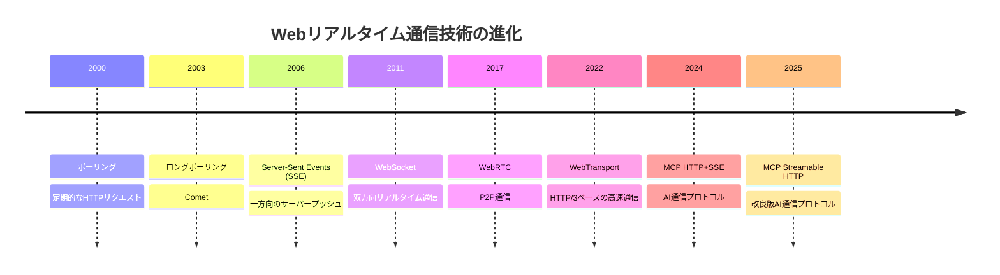
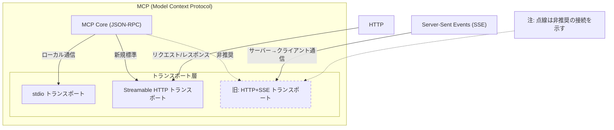
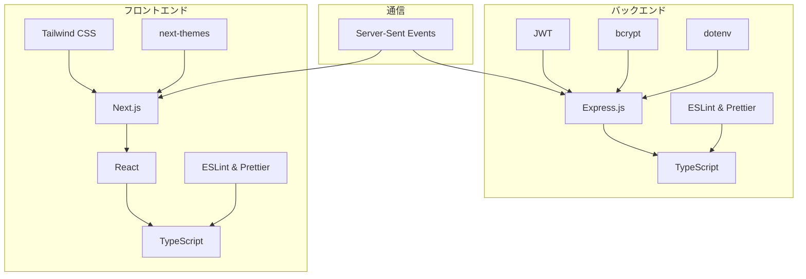
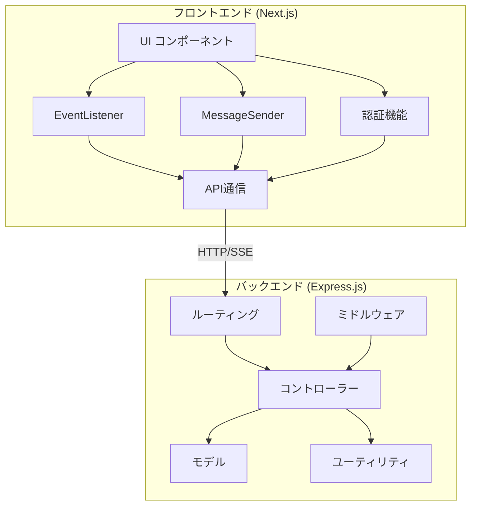
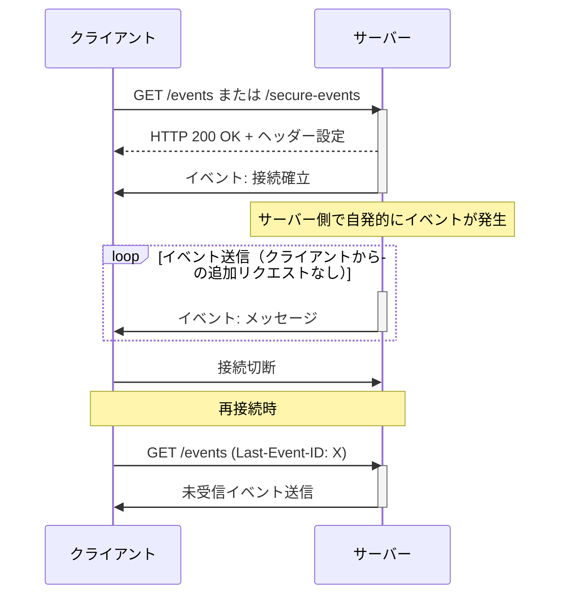
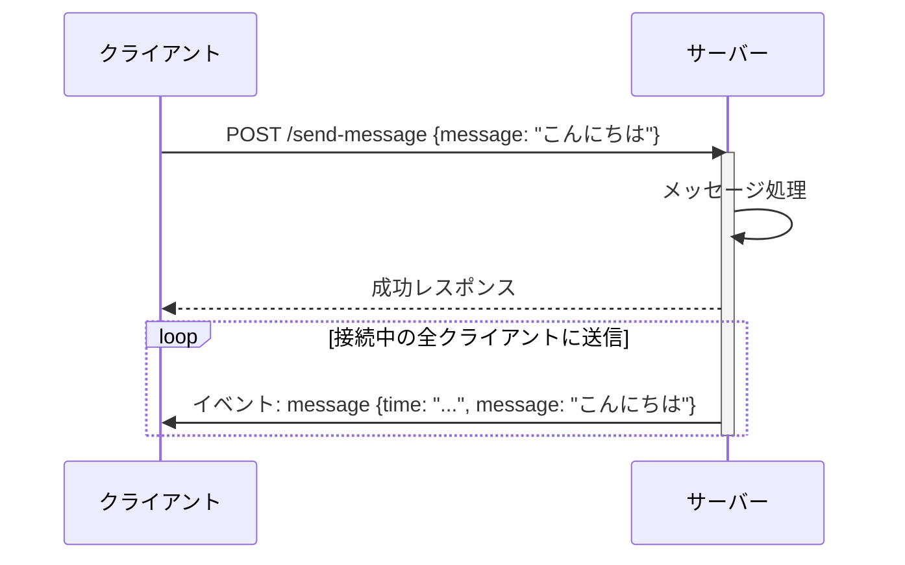
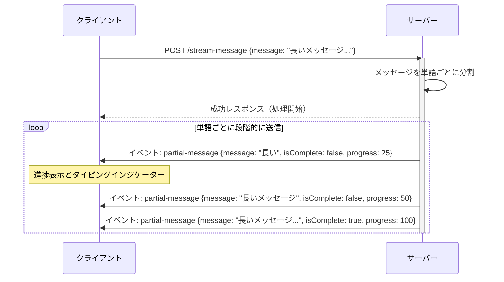
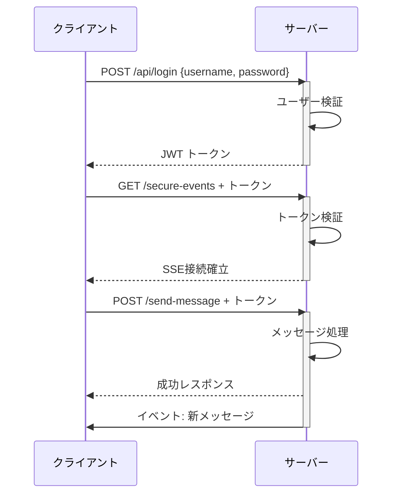

# Express.js + Next.jsで実装するSSEリアルタイム通信

## はじめに

Webアプリケーションにおけるリアルタイム通信は、ユーザー体験を大きく向上させる重要な要素です。チャットアプリ、通知システム、リアルタイム更新フィード、ダッシュボードなど、多くのモダンなWebアプリケーションでリアルタイム機能が求められています。

本記事では、**Server-Sent Events (SSE)** を使用したリアルタイム通信の実装方法について、Express.js（バックエンド）とNext.js（フロントエンド）を組み合わせた実践的なアプローチを紹介します。WebSocketと比較して実装が簡単でありながら、多くのユースケースで十分な機能を提供するSSEは、リアルタイム通信の実装において非常に魅力的な選択肢です。

さらに、最近のAI開発において重要なプロトコルであるMCP（Model Context Protocol）との関連性についても触れ、SSEがどのようにAI通信の基盤技術として活用されているかを解説します。

## SSEとは？ - リアルタイム通信の基礎

### Server-Sent Events (SSE) の基本概念

SSEは、HTTPを使用してサーバーからクライアントへのリアルタイム更新を可能にするWeb API技術です。従来のHTTPリクエスト/レスポンスモデルでは、クライアントがサーバーにリクエストを送信し、サーバーがレスポンスを返した時点で通信が完了します。一方、SSEでは接続が確立された後、サーバーは同じ接続を使用して継続的にデータをクライアントに送信し続けることができます。

SSEの主な特徴は以下の通りです：

- **HTTPプロトコル上で動作**: 標準のGETリクエストを使用するため、特別なプロトコルやポートが不要
- **一方向通信**: サーバーからクライアントへの通信に最適化
- **自動再接続**: 接続が切れた場合の自動再接続機能を内蔵
- **ファイアウォール対応**: WebSocketよりもファイアウォールやプロキシを通過しやすい
- **イベントID**: 各イベントにIDを付与し、再接続時に未受信イベントを取得可能

### SSEの基本形式

SSEでは、サーバーは特定のフォーマットでデータを送信します：

```
id: <イベントID>
event: <イベントタイプ>
data: <JSONデータ>

```

各フィールドは改行で区切られ、イベントの終わりは空行で示されます。この単純かつ明確なフォーマットにより、サーバーとクライアント間のデータ交換が容易になります。

### JWT認証の基本

リアルタイム通信においてセキュリティは非常に重要です。本実装では、JWT（JSON Web Token）を使用して認証を行います。JWTは、クライアントとサーバー間で安全に情報をやり取りするための方法で、以下のような流れで使用されます：

1. ユーザーがログインすると、サーバーがJWTトークンを発行
2. クライアントはこのトークンを使用して認証付きSSE接続を確立
3. トークンはヘッダー、クエリパラメータ、またはクッキーを通じて送信可能

JWTを使用することで、認証済みユーザーのみがSSEストリームにアクセスできるようになり、セキュアなリアルタイム通信が実現します。

## Webにおけるリアルタイム通信技術の比較

Web でのリアルタイム通信や双方向通信には様々な技術があります。以下はその比較です：

| 技術名           | トランスポート | 通信方向      | 特徴                                     | 用途                                 |
| ---------------- | -------------- | ------------- | ---------------------------------------- | ------------------------------------ |
| ポーリング       | TCP/HTTP       | 一方向        | クライアントが定期的にリクエスト         | シンプルな状態確認                   |
| ロングポーリング | TCP/HTTP       | 一方向        | サーバーは応答を遅延、更新があるまで保留 | 低頻度の通知                         |
| SSE              | TCP/HTTP       | 一方向        | サーバーから継続的にイベント送信         | AIの回答など段階的な情報提供         |
| WebSocket        | TCP            | 双方向        | 単一コネクションでの双方向通信           | チャット、リアルタイム更新           |
| WebRTC           | UDP            | 双方向        | P2P通信、低レイテンシ                    | ビデオ通話、ゲーム                   |
| WebTransport     | UDP/QUIC       | 一方向/双方向 | HTTP/3ベース、低レイテンシ               | 高性能ゲーム、メディアストリーミング |

以下のタイムラインは、Webにおけるリアルタイム通信技術の歴史的な進化を示しています。2000年代初頭の単純なポーリング技術から始まり、現在のAI通信プロトコルであるMCP Streamable HTTPに至るまでの発展を時系列で表しています。この進化の過程では、より効率的で低遅延な通信方式への移行と、より複雑な双方向通信の実現が主な流れとなっています。特に注目すべきは、2006年のSSEの登場と、2024年以降のAI通信プロトコルへの応用です。これらの技術は、それぞれの時代のWeb技術の制約と要求に応じて発展してきました。



以下の表は、様々なリアルタイム通信技術を効率性と実装の複雑さという2つの軸で比較しています。SSEはWebSocketほど複雑ではなく、ポーリングよりも効率的な中間的な位置にあることがわかります。

|            | **低複雑性**                       | **高複雑性**                              |
| ---------- | ---------------------------------- | ----------------------------------------- |
| **高効率** | • SSE<br>• MCP Streamable HTTP     | • WebSocket<br>• WebRTC<br>• WebTransport |
| **低効率** | • ポーリング<br>• ロングポーリング | （該当なし）                              |

**注：** 技術の進化は一般的に「ポーリング → ロングポーリング → SSE → MCP Streamable HTTP → WebSocket → WebRTC」の順に効率性と複雑性が増していきます。WebTransportはWebRTCと同等の複雑性を持ちます。

## MCPとの関連性 - AIコミュニケーションの未来

### MCP (Model Context Protocol) とは

MCP (Model Context Protocol) は、JSON-RPC を使用してメッセージをエンコードするプロトコルです。AI モデルとアプリケーション間の標準化されたインターフェースを提供し、異なるモデルやアプリケーション間の相互運用性を実現します。

このプロトコルは、AIモデルとアプリケーション間の通信を標準化することで、異なるAIモデルやアプリケーション間の相互運用性を高め、AI技術の統合をより簡単にすることを目指しています。

### MCPにおける通信方式の進化

クライアントとサーバー間の通信方式として、MCPでは以下の2つが定義されています：

1. **stdio (標準入出力経由)** - 主にローカル実行向け
2. **Streamable HTTP (HTTP ストリーミング経由)** - リモートサーバー向け

2025年4月時点では、多くのMCPクライアントとサーバー間の通信にはstdioが使用されています。これは、旧仕様である2024-11-05バージョンでは認証仕様が十分に定まっておらず、リモートサーバーでの実行にセキュリティ上の懸念があったためです。

新しい2025-03-26バージョンの仕様では、OAuth 2.1に基づく認証仕様やHTTPストリーミングを介した通信などの仕様が追加されました。MCPにおける認証の実装はoptional（任意）ですが、HTTPベースのトランスポートを使用する場合は仕様に準拠した認証の実装が推奨されています。

以下の図は、MCP（Model Context Protocol）のアーキテクチャと、そのトランスポート層の構成を示しています。MCPはコアとなるJSON-RPCベースの通信プロトコルと、それを様々な環境で利用するためのトランスポート層から構成されています。特に注目すべきは、トランスポート層における3つの方式（stdio、Streamable HTTP、旧HTTP+SSE）の関係性です。図中の点線は非推奨の接続を示しており、旧HTTP+SSEトランスポートが新しいStreamable HTTPトランスポートに置き換えられつつあることを表しています。また、SSEが旧トランスポート方式でサーバーからクライアントへの一方向通信に使用されていたことも示されています：



### SSEからStreamable HTTPへの進化

Streamable HTTP トランスポートは、旧仕様に存在した HTTP + SSE トランスポートを置き換える新しい方式です。旧方式のHTTP+SSEは、クライアント→サーバーの通信にHTTP、サーバー→クライアントの通信にSSE（一方向のPush通信）を使用していました。

Streamable HTTPトランスポートには以下の利点があります：

- **ステートレスなサーバー実装が可能** - 会話の状態を保持する必要がない場合にシンプルに実装できます
- **プレーンなHTTPサーバーとして実装可能** - SSEは必須ではありません
- **下位互換性を考慮した設計** - 旧仕様との互換性が維持されています
- **単一エンドポイント** - 旧仕様では複数のエンドポイントが必要でしたが、単一のエンドポイントで済みます
- **スケーラビリティの向上** - 各クライアントとの接続を常に維持する必要がありません
- **ネットワーク中断からの回復力** - 論理的なセッションIDを用いるため、ネットワーク中断時も対話を継続できます
- **水平スケーリングが容易** - セッションIDによるルーティングが可能になります

このように、SSEの技術はAI通信プロトコルの基盤として活用され、さらに進化を続けています。本記事で紹介するSSE実装の知識は、将来的なMCPサーバーの実装においても重要な基礎となるでしょう。

## アーキテクチャと技術スタック

### 技術スタックの関係図

以下の図は、このチュートリアルで使用する技術スタックとその関係性を示しています。バックエンド、フロントエンド、通信の3つの主要な領域に分かれており、それぞれの領域内での依存関係が明確に表現されています。バックエンドではExpress.jsを中心に、フロントエンドではNext.jsとReactを中心に構成されています。特に注目すべきは、SSE（Server-Sent Events）がバックエンドとフロントエンドの両方に接続されている点で、これがリアルタイム通信の核となる技術であることを示しています：



### アプリケーションアーキテクチャ図

以下の図は、アプリケーション全体のアーキテクチャを示しています。フロントエンド（Next.js）とバックエンド（Express.js）の2つの主要なコンポーネントとその内部構造、そして両者の間の通信方法を表現しています。フロントエンドはUIコンポーネントを中心に、イベントリスナー、メッセージ送信機能、認証機能などのコンポーネントで構成されています。バックエンドはMVCパターンに近い構造で、ルーティング、コントローラー、モデル、ミドルウェアなどの層に分かれています。特に重要なのは、フロントエンドのAPI通信コンポーネントとバックエンドのルーティング層をつなぐ「HTTP/SSE」の接続で、これがリアルタイム通信の核となる部分です：



### プロジェクト構造

```
sse-tutorial/
├── backend/                  # バックエンドアプリケーション
│   ├── .env                  # 環境変数設定ファイル
│   ├── .prettierrc           # Prettier設定
│   ├── eslint.config.mjs     # ESLint設定
│   ├── package.json          # プロジェクト設定
│   ├── tsconfig.json         # TypeScript設定
│   └── src/                  # ソースコード
│       ├── config/           # 設定ファイル
│       ├── controllers/      # コントローラー
│       ├── middleware/       # ミドルウェア
│       ├── models/           # モデル
│       ├── routes/           # ルーティング
│       ├── utils/            # ユーティリティ
│       └── server.ts         # メインサーバーファイル
└── frontend/                 # フロントエンドアプリケーション
    ├── .env                  # 環境変数設定ファイル
    ├── next.config.ts        # Next.js設定
    ├── package.json          # プロジェクト設定
    ├── tsconfig.json         # TypeScript設定
    └── src/                  # ソースコード
        ├── app/              # App Router
        │   ├── components/   # コンポーネント
        │   ├── lib/          # ユーティリティ関数
        │   ├── login/        # ログインページ
        │   ├── globals.css   # グローバルスタイル
        │   ├── layout.tsx    # ルートレイアウト
        │   ├── page.tsx      # ホームページ
        │   └── providers.tsx # プロバイダー
        └── middleware.ts     # ミドルウェア
```

## 実装のポイント

### SSE通信フロー

SSE通信の基本的なフローは以下の通りです。SSEの最も重要な特性は、一度接続が確立された後、**サーバーからクライアントへの通信が自発的に行われる**点です。これは従来のHTTP通信やポーリング、ロングポーリングとは根本的に異なります：

- **ポーリング**：クライアントが定期的にサーバーにリクエストを送信し、その都度新しい情報を取得します。サーバーからのプッシュはありません。
- **ロングポーリング**：クライアントがリクエストを送信し、サーバーは新しい情報が利用可能になるまでレスポンスを遅延します。情報を返した後、クライアントは再度リクエストを送信する必要があります。
- **SSE**：クライアントが最初に接続を確立した後は、サーバーが**クライアントからの追加リクエストなしに**自発的にイベントを送信できます。

この「サーバープッシュ」機能により、SSEはリアルタイム通知やライブフィード、AIの段階的な回答表示など、サーバーから継続的にデータを送信する必要があるシナリオに最適です。以下の図では、この重要な特性を「サーバー側で自発的にイベントが発生」という注釈と「イベント送信（クライアントからの追加リクエストなし）」というループラベルで明示しています。



### メッセージ送信フロー

SSEを使用したメッセージ送信には、通常の一括送信とストリーミング送信の2つの方法があります。

#### 通常のメッセージ送信

通常のメッセージ送信では、メッセージ全体が一度にクライアントに送信されます。これは、短いメッセージや即時の通知に適しています。



#### ストリーミングメッセージ送信

ストリーミングメッセージ送信では、メッセージが小さなチャンクに分割され、段階的にクライアントに送信されます。これにより、ChatGPTのような「考え中」の表示効果を実現できます。



ストリーミングメッセージ送信の特徴：

- メッセージが単語ごとに分割され、段階的に送信される
- 各チャンクには進捗情報（progress）が含まれる
- 最後のチャンクには完了フラグ（isComplete: true）が設定される
- クライアント側では、タイピングインジケーターやプログレスバーで進捗を表示できる

### 認証フロー

JWT認証を使用したSSE通信のフローは以下の通りです。この図は、ユーザー認証からSSE接続の確立、そしてメッセージ送信までの一連の流れを示しています。最初にクライアントがログイン情報を送信してJWTトークンを取得し、そのトークンを使用してSSE接続を確立します。その後、同じトークンを使用してメッセージを送信すると、サーバーはそのメッセージを処理し、SSE接続を通じて全クライアントに通知します。この認証フローにより、認証済みユーザーのみがSSEストリームにアクセスでき、セキュアなリアルタイム通信が実現します：



### バックエンド実装のポイント

バックエンドは、MVC（Model-View-Controller）パターンに近い構造を採用しています：

1. **モデル層**：

   - クライアント接続の管理
   - イベントの定義と送信機能
   - ユーザー認証情報の管理

2. **コントローラー層**：

   - 認証処理
   - SSE接続の確立と管理
   - メッセージ送信処理

3. **ルーティング層**：

   - 認証関連のエンドポイント
   - SSE接続エンドポイント
   - メッセージ送信エンドポイント

4. **ミドルウェア層**：

   - JWT認証ミドルウェア
   - リクエストロギングミドルウェア

5. **ユーティリティ層**：
   - ロギング機能

### フロントエンド実装のポイント

フロントエンドは、Next.jsのApp Routerを使用したコンポーネントベースのアーキテクチャを採用しています：

1. **ページ**：

   - メインページ
   - ログインページ

2. **コンポーネント**：

   - SSEイベントの受信と表示
   - メッセージ送信フォーム
   - 接続状態の表示
   - ナビゲーションバー
   - ダークモード切り替え

3. **ユーティリティ**：

   - SSE接続とAPI通信
   - 認証機能

4. **ミドルウェア**：
   - 認証チェックとリダイレクト

## デモアプリケーション

### 実装したアプリケーションのスクリーンショット

以下は、実装したアプリケーションの実際の画面です：

#### メインページ（ライトモード）


_メインページのライトモード表示。メッセージ送信フォームとイベントリスナーが表示されています。_

#### メインページ（ダークモード）


_メインページのダークモード表示。ダークテーマに最適化されたUIデザインが適用されています。_

#### ログインページ


_ユーザー認証のためのログインフォーム。ユーザー名とパスワードを入力してJWTトークンを取得します。_

#### リアルタイム通信デモ


_メッセージ送信と受信のデモ。送信されたメッセージがリアルタイムでイベントリストに表示されています。_

#### 接続状態の変化


_異なる接続状態（接続中、接続済み、再接続中、切断）の表示例。各状態は異なる色とアイコンで視覚的に区別されています。_

#### 開発者ツールでのSSE接続


_ブラウザの開発者ツールでのSSE接続の様子。Network タブでイベントストリームが確認できます。_

### GitHubリポジトリ

このプロジェクトのソースコードは以下のGitHubリポジトリで公開しています：

GitHub: SSE Tutorial Repository:
https://github.com/sbk0716/sse-tutorial

リポジトリには、バックエンドとフロントエンドの完全なソースコードが含まれており、READMEにはセットアップと実行手順が詳細に記載されています。

## 実装の特徴と機能

このアプリケーションには、以下の機能が実装されています：

1. **基本的なSSE機能**：

   - リアルタイムメッセージ配信
   - イベントタイプの区別（一般メッセージ、システムメッセージ、部分的メッセージ）
   - メッセージのストリーミング送信（ChatGPTのような段階的表示効果）
   - イベントIDと再接続時の未受信イベント再送信

2. **認証セキュリティ**：

   - JWTを使用したユーザー認証
   - 複数の認証方法（ヘッダー、クエリパラメータ、クッキー）
   - 認証済みユーザー専用のSSEエンドポイント

3. **安定性と信頼性**：

   - 接続数の制限によるサーバー保護
   - 長時間接続のタイムアウト管理
   - エラーハンドリングと再接続戦略（指数バックオフ）

4. **ユーザー体験の向上**：
   - ダークモードとライトモードの切り替え
   - レスポンシブデザイン
   - 接続状態の視覚的フィードバック
   - エラーと成功メッセージの明確な表示

## 技術スタックの詳細

### バックエンド

- **Express.js**: HTTPサーバーフレームワーク
- **TypeScript**: 型安全な開発環境
- **JWT**: 認証トークン
- **bcrypt**: パスワードハッシュ化
- **dotenv**: 環境変数管理
- **ESLint & Prettier**: コード品質とフォーマット

### フロントエンド

- **Next.js**: Reactフレームワーク
- **React**: UIライブラリ
- **TypeScript**: 型安全な開発環境
- **Tailwind CSS**: ユーティリティファーストのCSSフレームワーク
- **next-themes**: ダークモード管理
- **ESLint & Prettier**: コード品質とフォーマット

## まとめと次のステップ

本記事では、Express.jsとNext.jsを使用したServer-Sent Events（SSE）の実装方法について解説しました。SSEは、WebSocketよりも実装が簡単でありながら、多くのユースケースで十分な機能を提供するリアルタイム通信技術です。

また、MCPとの関連性についても触れ、SSEがAI通信の基盤技術として活用されていることを紹介しました。SSEの知識は、将来的なMCPサーバーの実装においても重要な基礎となります。

このチュートリアルを完了した後、以下の拡張機能を検討することができます：

1. **機能拡張**：

   - ユーザー登録機能
   - メッセージの永続化（データベース連携）
   - ユーザー間のプライベートメッセージ
   - リアルタイム通知システム

2. **セキュリティ強化**：

   - レート制限の実装
   - CSRFトークンの導入
   - HTTPSの設定
   - トークンのリフレッシュメカニズム

3. **パフォーマンス最適化**：

   - Redis/Memcachedを使用したイベントキャッシュ
   - クラスタリングによるスケーリング
   - WebSocketとSSEのハイブリッド実装

4. **デプロイ**：
   - Dockerコンテナ化
   - CI/CDパイプラインの設定
   - クラウドプラットフォームへのデプロイ

SSEを活用したリアルタイム通信は、Webアプリケーションのユーザー体験を大きく向上させる重要な要素です。本記事が、皆さんのリアルタイム通信実装の参考になれば幸いです。

## 参考リソース

- [MDN Web Docs: Server-Sent Events](https://developer.mozilla.org/ja/docs/Web/API/Server-sent_events)
- [Express.js 公式ドキュメント](https://expressjs.com/ja/)
- [Next.js 公式ドキュメント](https://nextjs.org/docs)
- [JWT 公式サイト](https://jwt.io/)
- [MCP (Model Context Protocol) 仕様](https://github.com/modelcontextprotocol/mcp)
